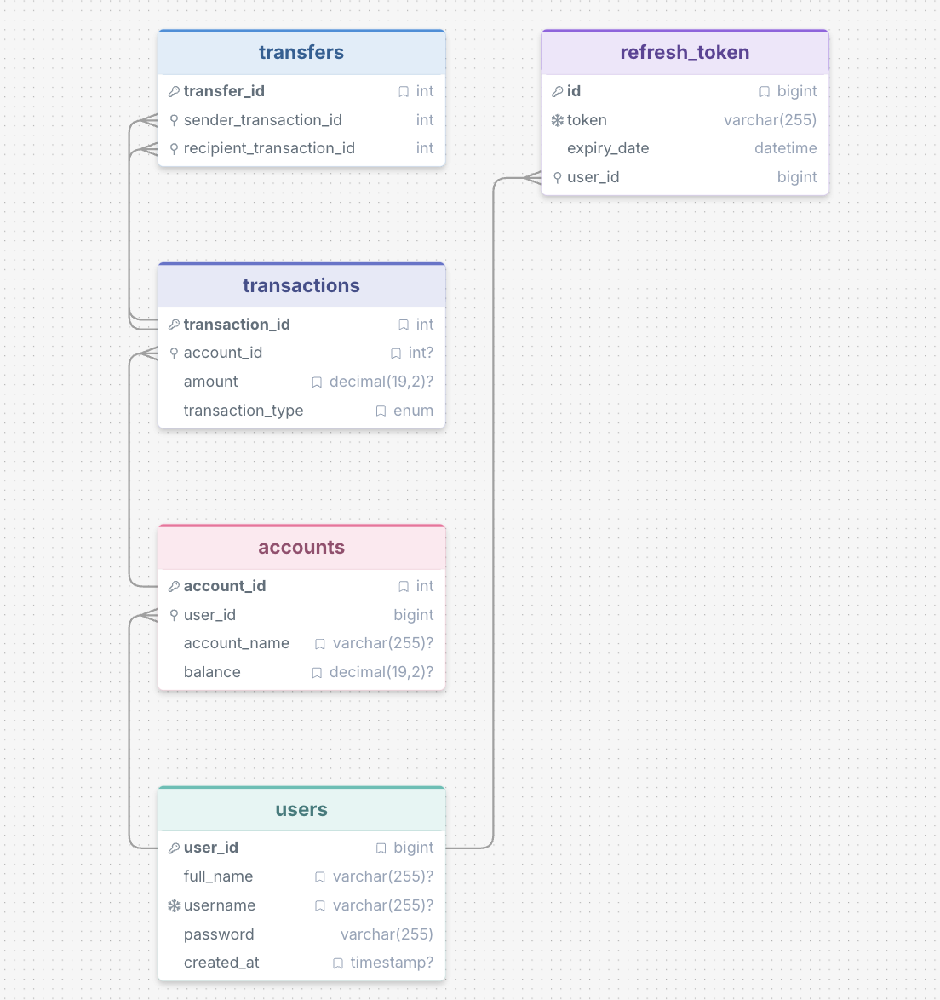

# Software Engineering Fundamentals

- This project is a simple Bank Web Application solely created to solidify Web Development and Software Engineering concepts

## Web Development Fundamentals

- Solidified my understanding on how a website works.
  - A website works through a client-server model, where the client components communicate through the server via API. The server processes the request from the client then retrieves or persist the data in a database, then send the response back to the client.
- User friendy UI/UX designs that are simple yet effective that provide straight forward information to the user.

## Software Engineering Fundamentals

- Understood the importance of SOLID Principles, especially Single Responsibility, and Dependency Injection. I used them a lot in the whole project to enforce code modularity, making the code easier to read, navigate, change or update, and test in isolation.
- Separation of Concerns design pattern was implemented overall in the project. MVC Architecture was used to separate each component.
- What improved into me was breaking the problems into smaller, digestible pieces. So I can make a solution for each piece, then gradually solve the problem overall.

## AI assisted programming

- AI is already here, and the best thing we can do as developers is to adapt. I treated AI as a partner to help me learn faster and helped me understand concepts deeper. But for me, the essence of software engineering is to solve problems, so we developers need to keep or enhance our problem solving and decision making skills without heavily relying to AI.

## Tech Stack

### Frontend

- React, TypeScript, Tailwind CSS, Vite

### Backend

- Spring Boot

### Database

- MySQL

### Testing

- Postman, Mockito, JUnit

### Other Tools

- Docker
- VS Code, IntelliJ IDEA, Cursor
- Github

### AI Tools (All Free Tier)

- Chat GPT, Google Gemini, Cursor free AI

## Project Structure

### Frontend

```
.
├── AGENTS.md
├── Dockerfile.dev
├── eslint.config.js
├── index.html
├── package-lock.json
├── package.json
├── src
│   ├── api
│   ├── App.tsx
│   ├── auth
│   ├── components
│   ├── global.css
│   ├── main.tsx
│   ├── pages
│   ├── routes.tsx
│   ├── types
│   └── util
├── tsconfig.app.json
├── tsconfig.json
├── tsconfig.node.json
└── vite.config.ts
```

### Backend

```
.
├── Dockerfile
├── HELP.md
├── mvnw
├── mvnw.cmd
├── pom.xml
├── src
│   ├── main
│   └── test
└── target
├── classes
├── generated-sources
└── test-classes
```

### Database ERD

<p align="center">
  
</p>
